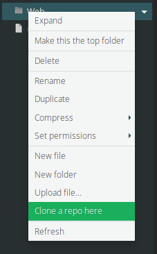
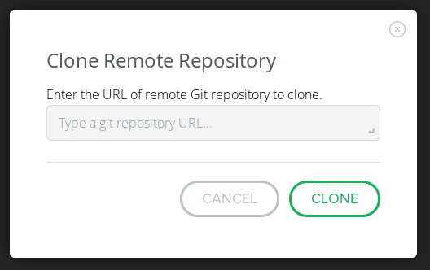

# Clone a Git repo while in Ace

This short tutorial will cover how to clone a Github repository while in the Ace editor.

## Step 1

Open up the Ace editor. Make sure the VM you want to clone the repo into is turned on.

## Step 2

On the right you'll see the file tree. Right click on a folder where you want the repo to reside. A menu will open. From that menu select `Clone a repo here`.

## Step 3

A modal window will pop-up. In this window you'll need to enter the repo URL and then click the `Clone` button (or press the Enter/Return key on your keyboard).

## Step 4

You're done. Job well done!