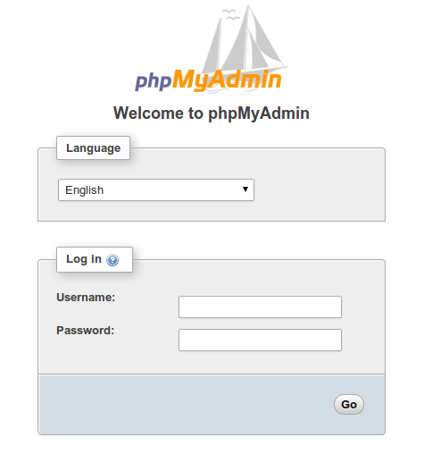
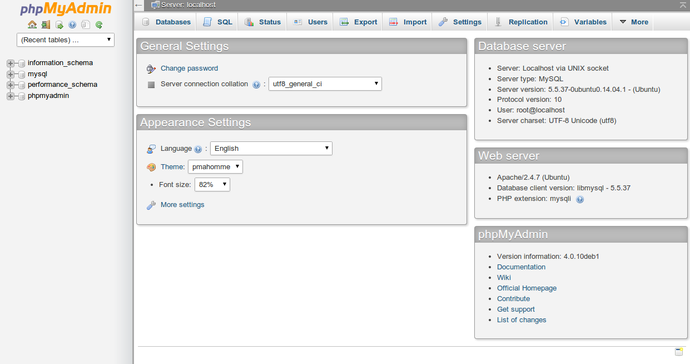

# Installing phpMyAdmin

This guide will cover the basic steps to install phpMyAdmin on your Koding VM. Each Koding VM comes preinstalled with phpMyAdmin, but if somehow your installation is messed up, you can always reffer back to this guide and install a fresh copy of phpMyAdmin.

Below are the steps you need to follow in order to install a clean instance of phpMyAdmin.

## Step 1

Open up your Koding terminal on the VM you want to install phpMyAdmin. Make sure the VM is turned on first.

## Step 2

Type in the following commands, that will update your VM packages and then install phpMyAdmin.

```
sudo apt-get update
sudo apt-get install phpmyadmin
```

## Step 3

During the installation process a few questions will popup in order to configure phpMyAdmin correctly.

1. For the first question you will need to select apache2.
2. When asked about using dbconfig-common to set up the database, select yes.
3. Enter your database administrator's password. Note: This is your Koding password.
4. The last thing you will need to choose is a password for the phpMyAdmin application itself.

## Step 4

After the process is complete you will still need to do 2 things. 
Number one is to enable the php5-mcrypt extension, which you can do by typing:

```
sudo php5enmod mcrypt
```

and number two is to restart the Apache for the changes to be recognized:

```
sudo service apache2 restart
```

## Step 5

You now have a fully functional phpMyAdmin instance on your VM, that you can access by heading over to `http://YOUR_KODING_USERNAME.kd.io/phpmyadmin`

The first thing you'll see is the login screen. You can enter `root` as the user and your Koding password as a password.



If the login is successful you'll see the following screen.



And that's it! If you made it this far, it means you did a great job.
